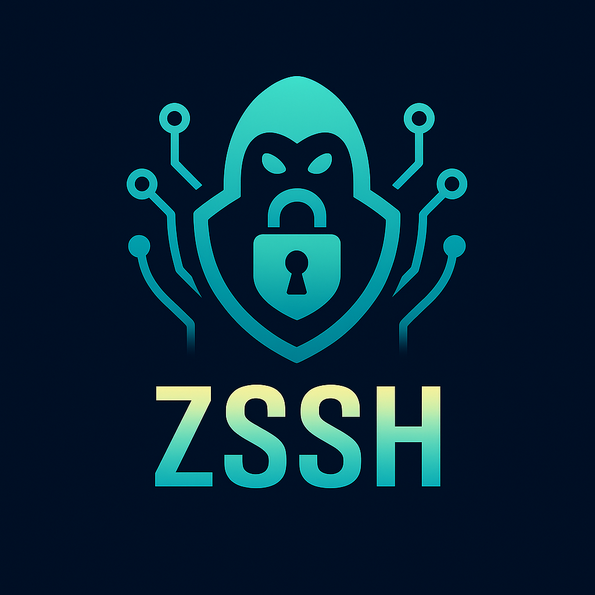

# zssh

<div align="center">
  

**Zig SSH 2.0 Client & Server Library**

</div>

---

## Badges

  
  
  
  

---

## Overview

**zssh** is a modern, Zig-native implementation of the SSH 2.0 protocol.  
It provides secure remote login, tunneling, and file transfer support with a clean async architecture.

Built on top of [`zcrypto`](https://github.com/ghostkellz/zcrypto) and [`zsync`](https://github.com/ghostkellz/zsync),  
**zssh** is designed for **servers, clients, and embedded systems** that demand speed and security without the legacy bloat.

---

## Features

- 🔐 Strong key exchange & encryption with `zcrypto`  
- 📡 Async client/server support with `zsync`  
- 🧩 Multiple authentication methods (password, pubkey, OIDC via `zauth`)  
- 🛠️ Tunneling, port forwarding, and subsystem support  
- 📁 Planned SFTP and scp-like secure file transfer  

---

## Roadmap

- [ ] Core SSH 2.0 transport  
- [ ] Terminal session support (PTY, channels)  
- [ ] Authentication backends (password, pubkey, OIDC)  
- [ ] SFTP subsystem  
- [ ] Multiplexed channels over QUIC (`zquic`)  

---

## Example

```zig
const std = @import("std");
const zssh = @import("zssh");

pub fn main() !void {
    var gpa = std.heap.GeneralPurposeAllocator(.{}){};
    defer std.debug.assert(!gpa.deinit());
    const allocator = &gpa.allocator;

    var server = try zssh.Server.init(allocator, .{
        .host = "0.0.0.0",
        .port = 22,
    });
    defer server.deinit();

    try server.listen();
}

